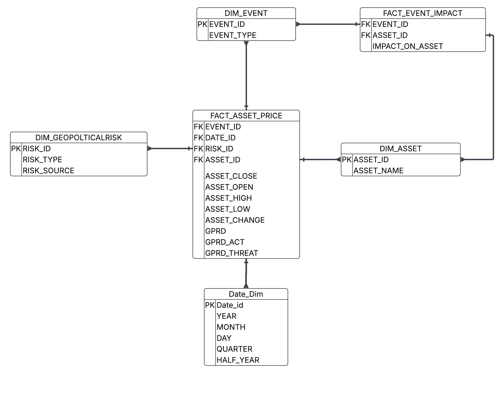
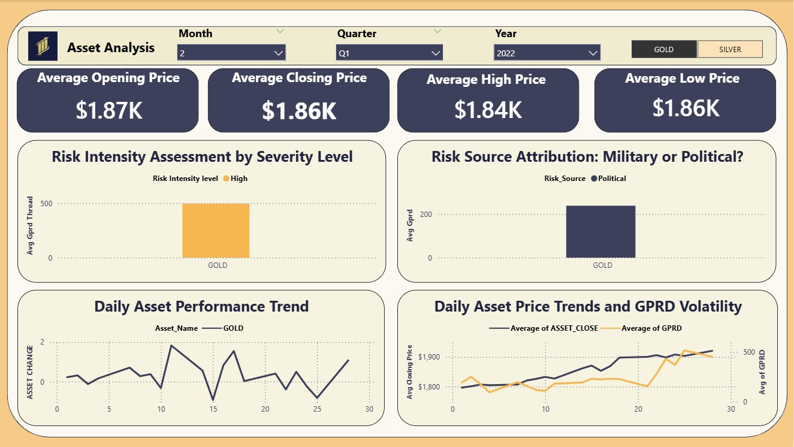

## 📋 Table of Contents

- [Project Overview](#project-overview)
  - [What This Project Solves](#what-this-project-solves)
  - [Pipeline Flow](#pipeline-flow)
- [Data Architecture & Galaxy Schema](#data-architecture--Galaxy-schema)
  - [Schema Diagram](#schema-diagram)
  - [Fact Tables](#fact-tables)
    - [FACT\_ASSET\_PRICE — Core Daily Metrics](#fact_asset_price--core-daily-metrics)
    - [FACT\_EVENT\_IMPACT — Event-Level Impact Attribution](#fact_event_impact--event-level-impact-attribution)
  - [Dimension Tables](#dimension-tables)
- [ETL Process (Informatica PowerCenter)](#etl-process-informatica-powercenter)
  - [Mapping 1 — Date Dimension Load](#mapping-1--date-dimension-load)
  - [Mapping 2 — Geopolitical Risk Dimension Load](#mapping-2--geopolitical-risk-dimension-load)
  - [Mapping 3 — Event Dimension Load](#mapping-3--event-dimension-load-complex-logic)
- [Dashboard & Visualizations](#dashboard--visualizations)
  - [Dashboard Screenshot](#dashboard-screenshot)
  - [Dashboard Components](#dashboard-components)
- [Key Insights](#key-insights)
- [Technical Challenges & Solutions](#technical-challenges--solutions)
- [Tech Stack](#tech-stack)
- [Repository Structure](#repository-structure)
- [Getting Started](#getting-started)
- [Contact](#contact)

## Project Overview

This project delivers a **production-grade ETL pipeline** that ingests, transforms, and models the relationship between **Geopolitical Risk Indices (GPRD)** and the **daily price performance of precious metals** — specifically **Gold** and **Silver**.

The core hypothesis is measurable: **when geopolitical risk rises, safe-haven assets like Gold exhibit statistically significant price surges**. This pipeline operationalizes that hypothesis into a queryable, visual, and analytically rigorous system.

### What This Project Solves

- **Data Fragmentation** — Consolidates disparate financial market feeds and risk index datasets into a single unified warehouse.
- **Analytical Opacity** — Transforms raw GPRD scores into classified risk tiers (Low / Medium / High) and traceable event impacts.
- **Reporting Lag** — Enables near-real-time BI dashboards that surface GPRD-to-price correlations across any date range, quarter, or asset type.

### Pipeline Flow

```
Raw Sources                   Informatica PowerCenter              SQL Server DWH         Power BI
─────────────                 ────────────────────────             ──────────────         ────────
Gold_Spot_Price_Daily   ─────►  Cleanse → Transform → Load  ─────►  Galaxy Schema    ─────►  Dashboard
Silver_Spot_Price       ─────►  Joiner / Expression / Filter ─────►  Fact + Dims   ─────►  KPIs & Charts
Geopolitical_Risk_Index ─────►  Sorter / Sequence Generator  ─────►  FACT_ASSET    ─────►  Trend Analysis
```

---

## Data Architecture & Galaxy Schema

The warehouse follows a **Galaxy Schema** design — optimized for OLAP workloads, BI tool compatibility, and dimensional drill-down queries.

### Schema Diagram



---

### Fact Tables

#### `FACT_ASSET_PRICE` — Core Daily Metrics
The central fact table. Every row represents **one asset's performance on one day** under a specific geopolitical risk context.

| Column | Type | Description |
|---|---|---|
| `DATE_ID` | FK | Join to `Date_Dim` |
| `ASSET_ID` | FK | Join to `DIM_ASSET` |
| `RISK_ID` | FK | Join to `DIM_GEOPOLITICALRISK` |
| `EVENT_ID` | FK | Join to `DIM_EVENT` |
| `ASSET_OPEN` | DECIMAL | Daily opening price |
| `ASSET_CLOSE` | DECIMAL | Daily closing price |
| `ASSET_HIGH` | DECIMAL | Intraday high |
| `ASSET_LOW` | DECIMAL | Intraday low |
| `ASSET_CHANGE` | DECIMAL | Net daily price change |
| `GPRD` | DECIMAL | General Geopolitical Risk Index |
| `GPRD_ACT` | DECIMAL | Acts-based sub-index |
| `GPRD_THREAT` | DECIMAL | Threat-based sub-index |

#### `FACT_EVENT_IMPACT` — Event-Level Impact Attribution
Captures the **quantified market impact** of specific geopolitical events on asset prices.

| Column | Type | Description |
|---|---|---|
| `EVENT_ID` | FK | Join to `DIM_EVENT` |
| `ASSET_ID` | FK | Join to `DIM_ASSET` |
| `IMPACT_ON_ASSET` | DECIMAL | Calculated price impact magnitude |

---

###  Dimension Tables

| Table | Purpose | Key Attributes |
|---|---|---|
| **`Date_Dim`** | Full calendar hierarchy for time-series slicing | `YEAR`, `MONTH`, `DAY`, `QUARTER`, `HALF_YEAR` |
| **`DIM_GEOPOLITICALRISK`** | Classifies each risk record by type and source | `RISK_TYPE` (Low/Medium/High), `RISK_SOURCE` (Military/Political) |
| **`DIM_ASSET`** | Asset lookup — Gold vs. Silver | `ASSET_NAME` |
| **`DIM_EVENT`** | Market event catalog with type classification | `EVENT_TYPE` |

---

##  ETL Process (Informatica PowerCenter)

Three core mappings drive the pipeline, each targeting a specific dimension or fact load.

### Mapping 1 — Date Dimension Load
**Source:** `Gold_Spot_Price_Daily`

Extracts the full date range from price history and engineers a complete calendar dimension.

- **EXPTRANS (Expression):** Derives `Year`, `Month`, `Day`, `Quarter`, `Half_Year`
- **SEQTRANS (Sequence Generator):** Mints the surrogate key `DATE_ID`
- **Target:** `Date_Dim`

---

### Mapping 2 — Geopolitical Risk Dimension Load
**Source:** `Geopolitical_Risk_Index`

Standardizes raw GPRD data and applies a **three-tier risk classification model**.

- **SRTTRANS (Sorter):** Orders records by risk level and source for consistent bucketing
- **Expression Transformation:** Evaluates `GPRD`, `GPRD_ACT`, and `GPRD_THREAT` scores, then classifies each record as **Low**, **Medium**, or **High** risk
- **Target:** `DIM_GEOPOLITICALRISK`

---

### Mapping 3 — Event Dimension Load *(Complex Logic)*
**Sources:** `Gold_Spot_Price` + `Silver_Spot_Price` + `Geopolitical_Risk_Index`

The most analytically rich mapping — identifies market events and calculates their **causal price impact** during high-risk windows.

- **JNRTRANS (Joiner):** Multi-source join on date key linking price data to risk indices
- **Expression Transformation:** Computes `IMPACT_ON_GOLD` and `IMPACT_ON_SILVER` as a function of price delta during elevated GPRD periods
- **Filter Transformation:** Prunes low-significance events — only **materially impactful** events are persisted
- **Target:** `DIM_EVENT`

---

##  Dashboard & Visualizations

The analytical layer is delivered as an interactive **Power BI dashboard** titled *"Asset Analysis"*, designed for both executive and analytical audiences.

### Dashboard Screenshot



> *Filtered view: Gold performance, Q1 2022, Month 2. Toggle between GOLD and SILVER assets using the top-right selector.*

---

### Dashboard Components

**KPI Cards — Instant Price Summary**
Four headline cards surface average price statistics for the selected period at a glance:

| Metric | Value (Q1 2022, Month 2) |
|---|---|
| Average Opening Price | **$1.87K** |
| Average Closing Price | **$1.86K** |
| Average High Price | **$1.84K** |
| Average Low Price | **$1.86K** |

---

**Risk Intensity Assessment by Severity Level**
Bar chart segmented by `RISK_TYPE` (Low / Medium / High). Plots **Average GPRD Threat score** per asset, allowing analysts to identify which risk tiers drive the most price sensitivity.

---

**Risk Source Attribution: Military or Political?**
Comparative bar chart breaking GPRD down by `RISK_SOURCE`. Distinguishes between **Military** and **Political** catalysts to determine which risk type exerts greater price pressure on precious metals.

---

**Daily Asset Performance Trend**
Time-series line chart tracking `ASSET_CHANGE` day-over-day. Exposes volatility clusters and mean-reversion patterns across the selected date range.

---

**Daily Asset Price Trends & GPRD Volatility** *(Dual-Axis)*
The flagship chart — overlays `Average ASSET_CLOSE` against `Average GPRD` on a shared time axis. **Visually demonstrates the leading-indicator relationship** between geopolitical risk escalation and gold price appreciation.

---

## Key Insights

Based on the data modeled and visualized through this pipeline:

- **Safe-Haven Behavior Confirmed:** Gold closing prices exhibit a measurable positive correlation with GPRD escalation, particularly when the `GPRD_THREAT` sub-index rises — consistent with flight-to-safety market dynamics.

- **Political Risk Dominates:** `RISK_SOURCE = Political` contributes a higher average GPRD score than Military risk in the analyzed periods, suggesting that political instability is a stronger predictor of gold price movements than direct military acts.

- **Volatility Clustering:** The Daily Asset Performance Trend reveals pronounced volatility clusters around high-GPRD periods — asset change scores diverge significantly from the mean when risk indices spike.

- **Lag Effect Observable:** The dual-axis GPRD vs. Price chart indicates a **short lag (1–3 days)** between GPRD index peaks and Gold price response peaks — a finding with potential value for short-horizon forecasting models.

---

## Technical Challenges & Solutions

### 1. Date Format Standardization
**Problem:** Source datasets contained inconsistent date formats that Informatica's native Date/Time parser could not ingest reliably.

**Solution:** All date fields were initially imported as `VARCHAR`, then normalized using an Expression Transformation before being cast to `Date` type — ensuring zero row rejections on date parsing.

---

### 2. Decimal Precision & Delimiter Conflicts
**Problem:** Financial datasets used non-standard decimal delimiters, causing the Integration Service to skip rows during numeric parsing.

**Solution:** Price fields were staged as strings, then converted with `TO_DECIMAL()` after delimiter normalization — preserving full numeric precision across all Gold and Silver metrics.

---

### 3. Joiner Cache Memory Exhaustion
**Problem:** The three-source join in Mapping 3 produced incomplete results due to the Integration Service exceeding its default cache allocation.

**Solution:** **Index Cache** and **Data Cache** sizes were explicitly tuned upward within Workflow Manager — eliminating the truncation and ensuring full result sets were joined and loaded.

---

## Tech Stack

| Layer | Tool / Technology |
|---|---|
| **ETL Orchestration** | Informatica PowerCenter (Mapping Designer, Workflow Manager) |
| **Transformations** | Source Qualifier, Expression, Joiner, Sorter, Filter, Router, Lookup, Union, Sequence Generator |
| **Data Warehouse** | Microsoft SQL Server |
| **Data Model** | Galaxy Schema (Dimensional Modeling) |
| **BI & Visualization** | Microsoft Power BI |
| **Schema Design** | Entity-Relationship Diagrams (ERD) |

---

## Repository Structure

```
├── etl/                        # Informatica mappings and workflow definitions
│   ├── mapping_date_dim/
│   ├── mapping_geopolitical_risk/
│   └── mapping_event_dim/
├── Design_Galaxy_Schema/         # ERD diagrams and SQL DDL scripts
│   ├── Galaxy_Schema.JPG
│   └── schema_ddl.sql
└── dashboard/                  # Power BI report files and screenshots
    ├── GOLD_PERFORMANCE.jpg
    └── AssetAnalysis.pbix
```

---

## Getting Started

1. **Provision the Database** — Run the DDL scripts in `design_Galaxy_Schema/schema_ddl.sql` against your SQL Server instance to create the Galaxy schema.
2. **Configure Informatica** — Import the mapping XMLs from `etl/` into your PowerCenter repository and update source/target connection objects.
3. **Run Workflows** — Execute mappings in order: Date Dim → Geopolitical Risk Dim → Event Dim → Fact Load.
4. **Connect Power BI** — Open `dashboard/AssetAnalysis.pbix` and point the data source to your populated SQL Server warehouse.
5. **Explore** — Use the Month, Quarter, and Year slicers on the dashboard to drill into any analytical window.

---

##  Contact

**[AMR KHALED   ]** — Data Engineer  
 [amrkhaled123555@gmail.com] |  [www.linkedin.com/in/amr-khaled-61121626a] 

